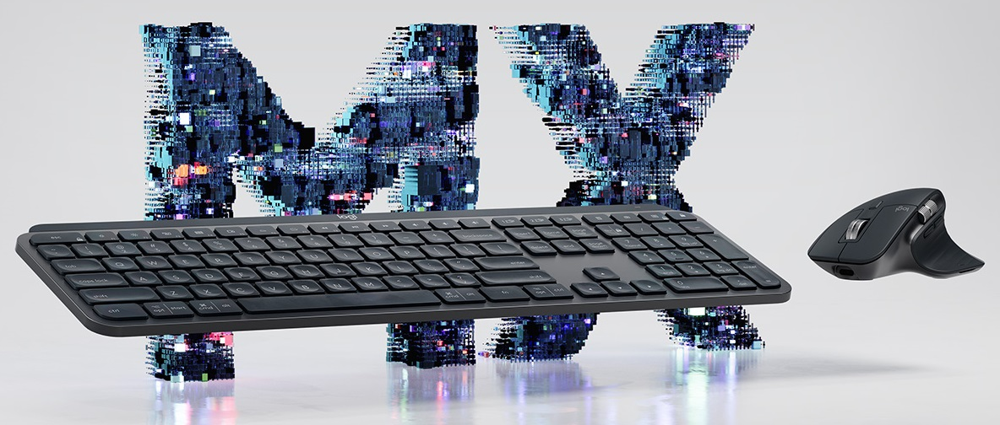
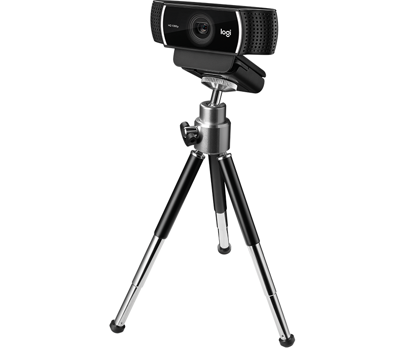

# Your mission

Logitech just released **[MX Master 3](https://www.logitech.com/en-ch/product/mx-master-3)** and **[MX Keys](https://www.logitech.com/en-ch/product/mx-keys-wireless-keyboard)**, which feature game-changing wireless connectivity, advanced tracking and configuration.

We want you to create an innovative solution to fit a need or add value to digital workers. It can be a feature, a product enhancement, an app or tool. For instance coding for developers, content creation for designers, or any experience you think is missing in your day at work...

Each team will be given bundle of MX Master 3, MX Keys keyboard and a [C922 Pro Stream](https://www.logitech.com/en-ch/product/c922-pro-stream-webcam) webcam:

    

You will be able leverage our SDK camera input and will be given technical support and various code samples.

# Rewards

Winners will get amazing prizes from our brands:

# Food for Thoughts

* Leverage the SDK to perform code detection even when user types in a simple text editor.

* Write an extension for your favorite code editor.

* Leverage MX Master 3 gesture detection (e.g. single tap on touch wheel) to display contextual menu (code completion for instance), share a code snippet..

* Use Slack / StackOverflow APIs to bridge with others.

* Enhance 3D object manipulation with hi-resolution wheel and thumb-wheel.

* Use the SDK, the Logitech C922 webcam and some Computer Vision magic to: monitor your activity (presence detection), attention span (gaze detection, keyboard/mouse activity) and provide recommendations, analytics, etc.

# Resources

* [Input Device Monitor SDK](./devmon/) : **hack into our devices!** Spy or capture device events!

*  Input event injections docs (Win [here](https://msdn.microsoft.com/fr-fr/library/windows/desktop/ms646304(v=vs.85).aspx) and [there](https://msdn.microsoft.com/en-us/library/windows/desktop/ms646310(v=vs.85).aspx), OSX [here](https://developer.apple.com/documentation/coregraphics/1456564-cgeventcreatekeyboardevent) and [there](https://developer.apple.com/documentation/coregraphics/1456527-cgeventpost), [Linux](https://www.kernel.org/doc/html/v4.12/input/uinput.html))

* Unleash the power of the **Logitech C922 webcam**! Start with [this](https://github.com/spmallick/learnopencv) comprehensive collection of OpenCV code samples

* Want a quick Computer Vision sample to get you started? [This](./cv) should be a good first step towards your human activity monitoring system (no cloud involved ;-)

# Support

For support, you can either ping us on [our Slack channel](https://hackzurich2019.slack.com/messages/CLCLWJWBU) or just come to our booth!

    

