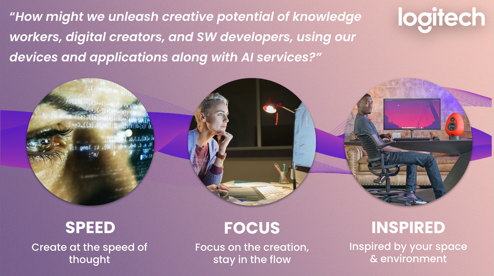

This year the Logitech challenge is about prototyping creative answers to the following question:

**How might we unleash creative potential of knowledge workers, digital creators, and SW developers, using our devices and applications along with AI services?**

## Present your demo at our booth for a chance to win an amazing prize
- Ready to take up our challenge?, make sure to register at our booth and borrow some Logitech gear.

- Each team will get 5 minutes to show a demo on Sunday at 12 (when hacking ends).

- We highly recommend you to prepare a short video showing your demo at its best. It can help you to avoid the 'demo effect'.

# Resources
- Logitech Options+ 
- Loupdeck [SW](https://support.loupedeck.com/downloads) and [SDK](https://support.loupedeck.com/getting-started)

# Support

For support, you can either ping us on [Discord](https://discord.com/channels/1079762641309925406/1178706240306696232) or just come to our booth!

    

